# Sense Claude Monitor

**Sound API plugin + Claude Code cowork = a complete health monitoring product.**

We built a [Claude Code plugin](https://github.com/meanmin/sense-claude) that connects the Cochl.Sense sound recognition API.
Then we used Claude Code's **cowork** capability to turn raw audio analysis into automated weekly health reports — no manual interpretation needed.

> **The idea:** A plugin gives Claude Code a new *ability*. Cowork turns that ability into a *workflow*.
> This project is the proof — from plugin to product in one repository.

### What it does

Feed audio files into 3 specialized monitors. Get back structured JSON logs and publication-ready weekly reports — charts, trend analysis, and clinical recommendations included.

| Monitor | Detects | Report highlights |
|---------|---------|-------------------|
| **Baby Cry** | Crying, screaming, moaning | Cry intensity trend (Normal → Pain Zone), hourly distribution |
| **Elder Care** | Falls, coughing, vomiting, night movement | Fall-risk alerts, cough escalation tracking |
| **Sleep** | Snoring, sleep disruptions, fatigue signals | OSA risk screening, REM-band snoring analysis |

### Sample Reports

<table>
<tr>
<td align="center"><b>Baby Cry Weekly Report</b></td>
<td align="center"><b>Elder Care Weekly Report</b></td>
<td align="center"><b>Sleep Disorder Weekly Report</b></td>
</tr>
<tr>
<td>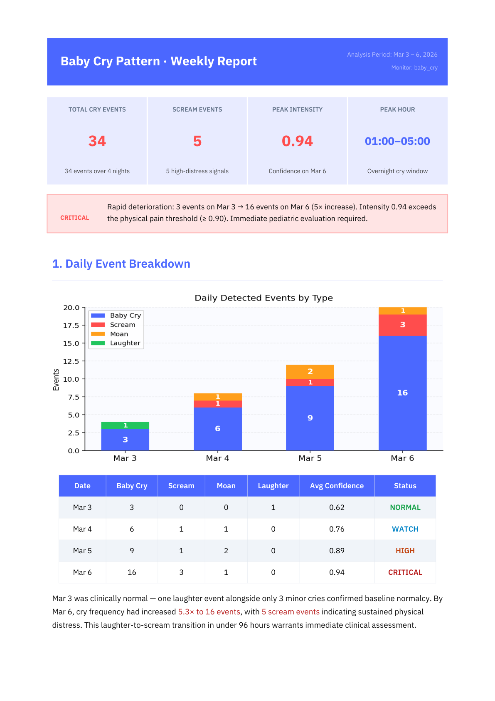</td>
<td>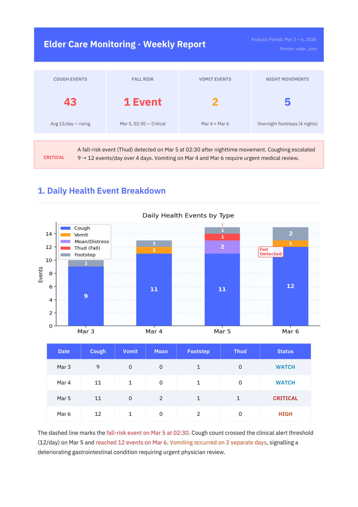</td>
<td>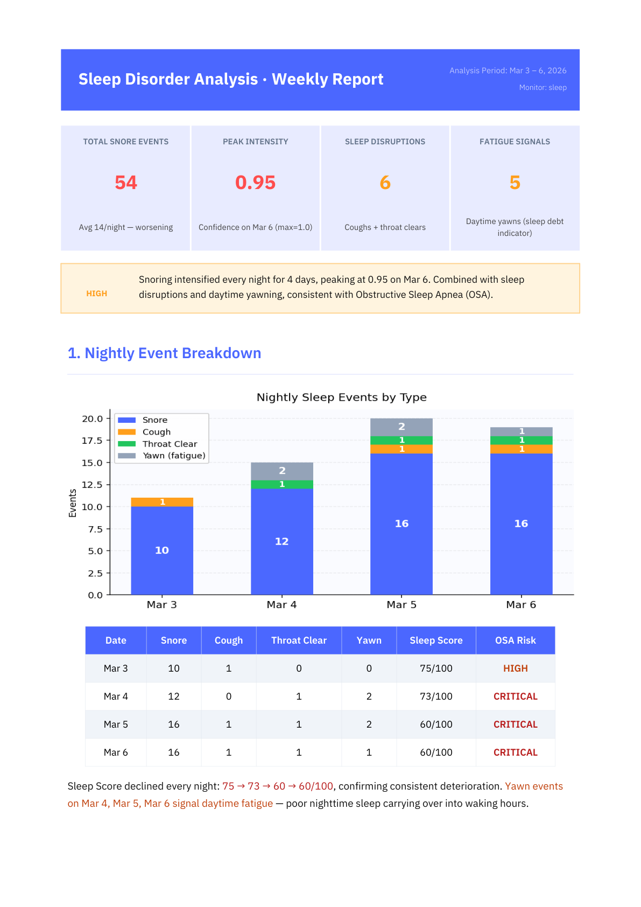</td>
</tr>
<tr>
<td><sub>5x cry increase in 4 days → Physical Pain Zone</sub></td>
<td><sub>Fall (Thud) detected at 02:30 AM</sub></td>
<td><sub>Snoring peaked at 0.95, suspected OSA</sub></td>
</tr>
</table>

> Full reports (4-5 pages each with charts and recommendations) are in `monitors/*/reports/`.

### Plugin alone vs. Plugin + Cowork

| | Plugin only | Plugin + Cowork |
|---|---|---|
| **Output** | JSON log of detected sound events | JSON log + weekly PDF report with charts, trends, and recommendations |
| **Human effort** | You read the logs, make the charts, write the analysis | You provide the audio file — that's it |
| **Value** | Data | Actionable insights ready for clinical or personal use |

---

## Quick Start (5-Minute Setup)

### 1. Download the Project

```bash
git clone https://github.com/meanmin/sense-claude-monitor.git
cd sense-claude-monitor
```

Or download the ZIP and extract it.

### 2. Install the sense-claude Plugin (Claude Code Users)

If you use [Claude Code](https://claude.com/claude-code), install the [sense-claude plugin](https://github.com/meanmin/sense-claude) for guided Cochl.Sense integration:

```bash
/plugin marketplace add meanmin/sense-claude
/plugin install cochl-sense-api
```

### 3. Create Python Virtual Environment + Install Dependencies

> Python 3.9 or higher required. Python 3.11+ requires a virtual environment.

```bash
python3 -m venv venv
source venv/bin/activate        # Windows: venv\Scripts\activate

pip install python-dotenv
pip install cochl --no-deps
pip install soundfile requests numpy python-dateutil urllib3 pydantic
```

### 4. Configure API Key

Get your project key from the [Cochl Dashboard](https://dashboard.cochl.ai).

```bash
cp .env.example .env
# Open .env and replace with your actual key
```

```
COCHL_API_KEY=your_actual_api_key_here
```

### 5. Run Audio Analysis

Provide your own audio file as an argument. Supported formats: `.wav`, `.mp3`, `.flac`, `.ogg`, etc.

```bash
# Baby cry analysis
python monitors/baby_cry/logger.py your_audio_file.mp3

# Elder care analysis
python monitors/elder_care/logger.py your_audio_file.mp3

# Sleep monitoring
python monitors/sleep/logger.py your_audio_file.mp3
```

### 6. View Results

```bash
# Per-monitor logs
cat monitors/baby_cry/logs/cry_log_*.json
cat monitors/elder_care/logs/care_log_*.json
cat monitors/sleep/logs/sleep_log_*.json

# Weekly report PDFs (samples included)
ls monitors/*/reports/*.pdf
```

---

## Project Structure

```
sense-claude-monitor/
├── .env                          # API key (not included in git)
├── .env.example                  # API key template
├── README.md                     # This file
├── docs/
│   ├── PRD.md                    # Product Requirements Document
│   └── screenshots/              # Report page images for README
│
├── monitors/
│   ├── baby_cry/
│   │   ├── config.json           # Cochl SDK configuration
│   │   ├── logger.py             # Analysis script
│   │   ├── logs/                 # JSON analysis logs
│   │   │   └── cry_log_YYYYMMDD.json
│   │   └── reports/              # Example weekly report PDFs
│   │       └── baby_cry_weekly_report_20260306.pdf
│   │
│   ├── elder_care/
│   │   ├── config.json
│   │   ├── logger.py
│   │   ├── logs/
│   │   │   └── care_log_YYYYMMDD.json
│   │   └── reports/
│   │       └── elder_care_weekly_report_20260306.pdf
│   │
│   └── sleep/
│       ├── config.json
│       ├── logger.py
│       ├── logs/
│       │   └── sleep_log_YYYYMMDD.json
│       └── reports/
│           └── sleep_weekly_report_20260306.pdf
│
└── venv/                         # Python virtual environment (not in git)
```

---

## Detection Tags by Monitor

All tags are based on the official [Cochl.Sense Sound Tags](https://docs.cochl.ai/sense/home/soundtags/) list.

### Baby Cry Monitor

| Tag | Purpose |
|-----|---------|
| `Baby_cry` | Direct baby crying detection |
| `Scream` | Fear/distress response |
| `Moan` | Pain-related groaning |
| `Baby_laughter` | Baby laughter (baseline reference) |

### Elder Care Monitor

| Tag | Category | Purpose |
|-----|----------|---------|
| `Thud` | fall | Fall impact sound |
| `Glass_break` | fall | Glass breaking |
| `Scream` | distress | Screaming |
| `Moan` | distress | Pain-related groaning |
| `Vomit` | health | Vomiting |
| `Cough` | health | Coughing |
| `Footstep` | night_movement | Nighttime movement |

### Sleep Monitor

| Tag | Category | Purpose |
|-----|----------|---------|
| `Snore` | snoring | Snoring |
| `Cough` | sleep_disruption | Coughing during sleep |
| `Throat_clear` | sleep_disruption | Throat clearing |
| `Yawn` | sleep_quality | Yawning |

---

## Log Format

Each analysis run generates a date-based JSON file in the `logs/` folder.
Multiple runs on the same day are appended to the same file.

```json
[
  {
    "monitor": "baby_cry",
    "source_file": "sample.wav",
    "analyzed_at": "2026-03-06T03:10:42.553",
    "events": [
      {
        "tag": "Baby_cry",
        "confidence": 0.9710,
        "severity": "critical",
        "description": "Sound of a baby crying, often high-pitched and repetitive.",
        "start_time": 0,
        "end_time": 2
      }
    ]
  }
]
```

---

## Tech Stack

| Component | Technology |
|-----------|------------|
| Sound Analysis | [Cochl.Sense Cloud API](https://docs.cochl.ai) v2.33.0 |
| Python SDK | `cochl` 1.0.12 (`cochl.sense`) |
| Agent | Claude Code (Claude Opus 4.6) |
| Reports | matplotlib + reportlab PDF |
| Runtime | Python 3.9+ |

---

## Weekly Report Samples

Each monitor generates a multi-page PDF report. Below are all pages from the sample reports.

<details>
<summary><b>Baby Cry Weekly Report (4 pages)</b> — 5x cry increase, entering Physical Pain Zone</summary>

| Page 1: KPI + Daily Breakdown | Page 2: Cry Intensity Trend |
|---|---|
|  | 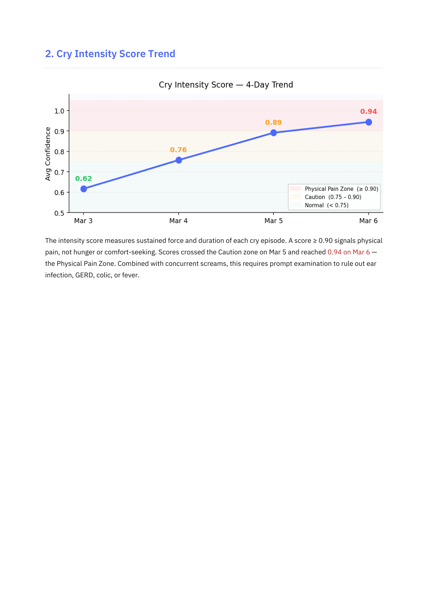 |

| Page 3: Hourly Distribution | Page 4: Recommendations |
|---|---|
| 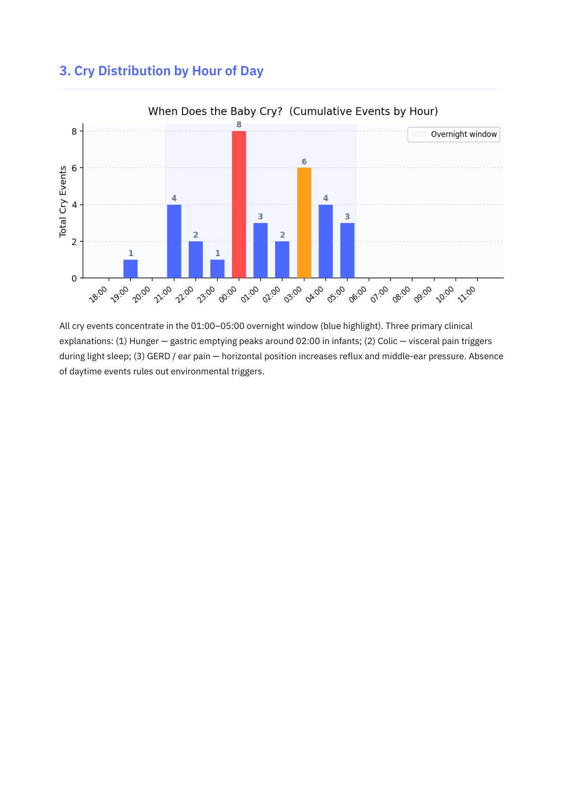 | 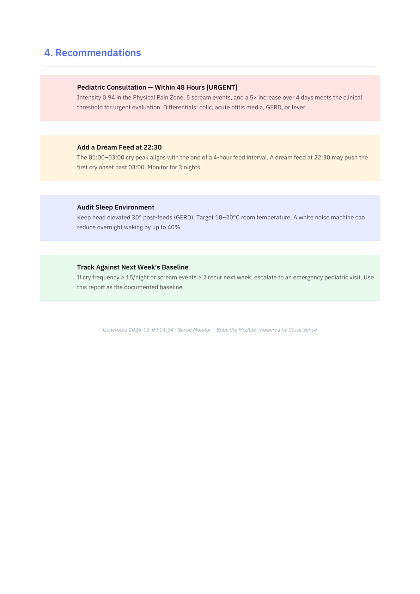 |

</details>

<details>
<summary><b>Elder Care Weekly Report (5 pages)</b> — Fall detected, cough escalation at dawn/night</summary>

| Page 1: KPI + Daily Breakdown | Page 2: Cough Frequency Trend |
|---|---|
|  | 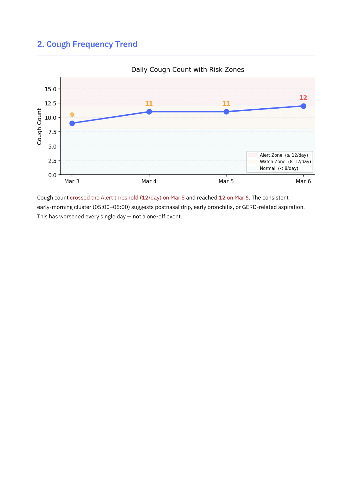 |

| Page 3: Hourly Distribution | Page 4: Fall-Risk Detail |
|---|---|
| 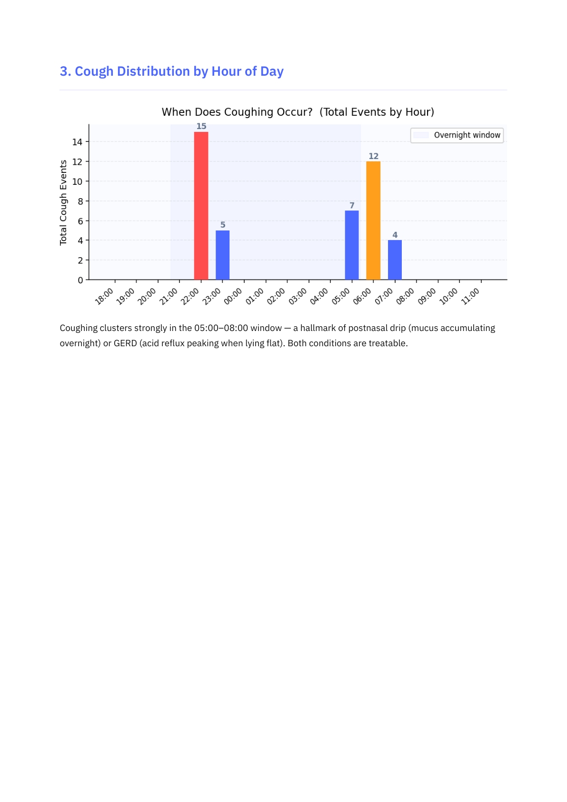 | 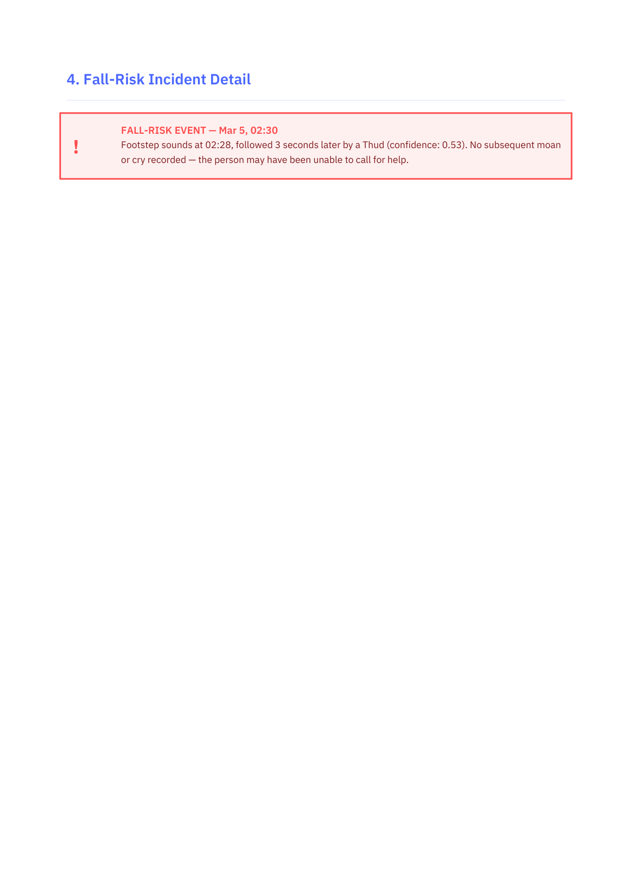 |

| Page 5: Recommendations |
|---|
| 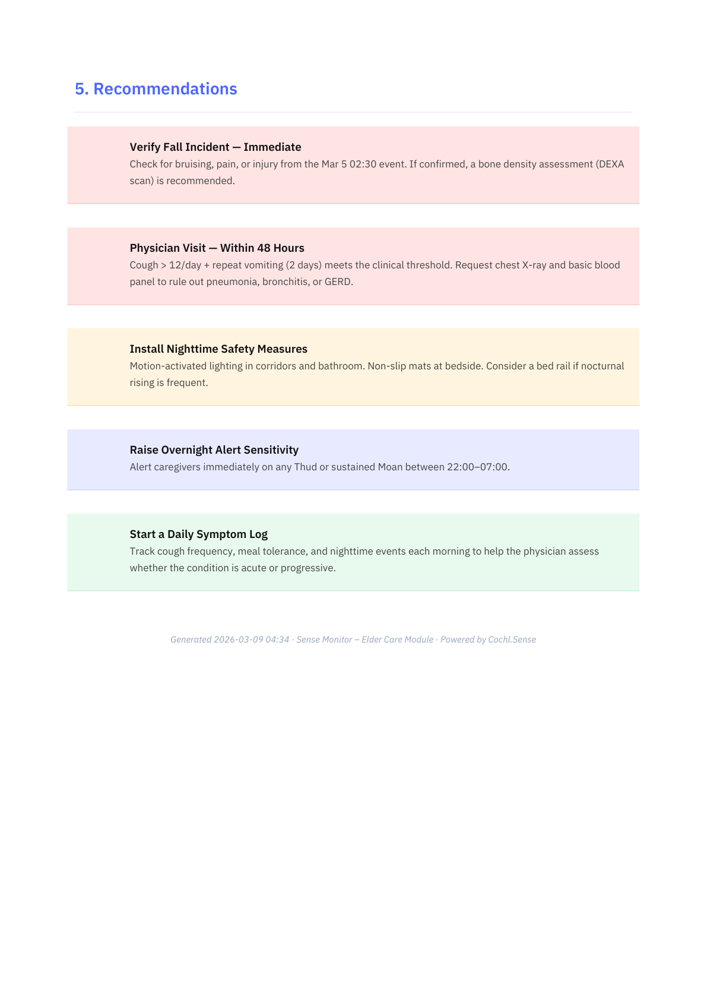 |

</details>

<details>
<summary><b>Sleep Weekly Report (4 pages)</b> — Snoring at 2-4 AM, suspected OSA</summary>

| Page 1: KPI + Nightly Breakdown | Page 2: Snoring Intensity + Disruption Index |
|---|---|
|  | 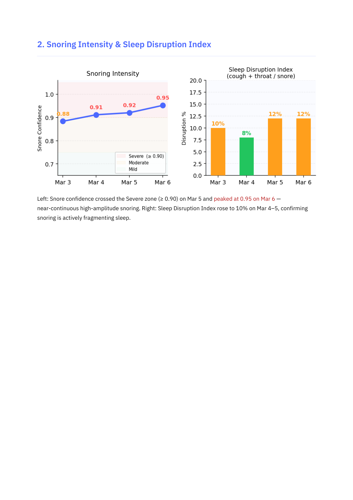 |

| Page 3: Hourly Distribution | Page 4: Recommendations |
|---|---|
| 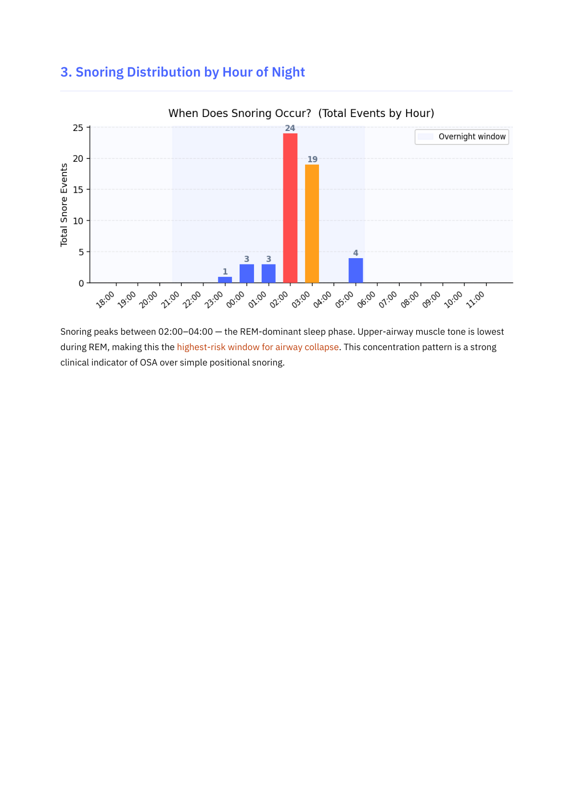 | 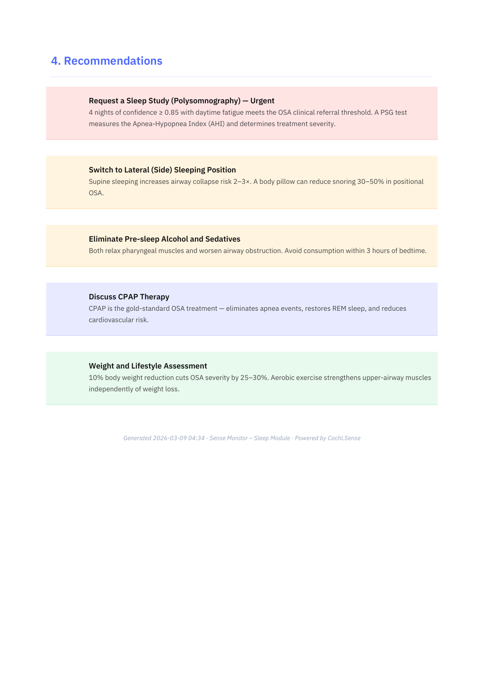 |

</details>

---

## Powered by

- [Cochl.Sense](https://www.cochl.ai/product/) — AI Sound Recognition
- [sense-claude plugin](https://github.com/meanmin/sense-claude) — Claude Code Integration
